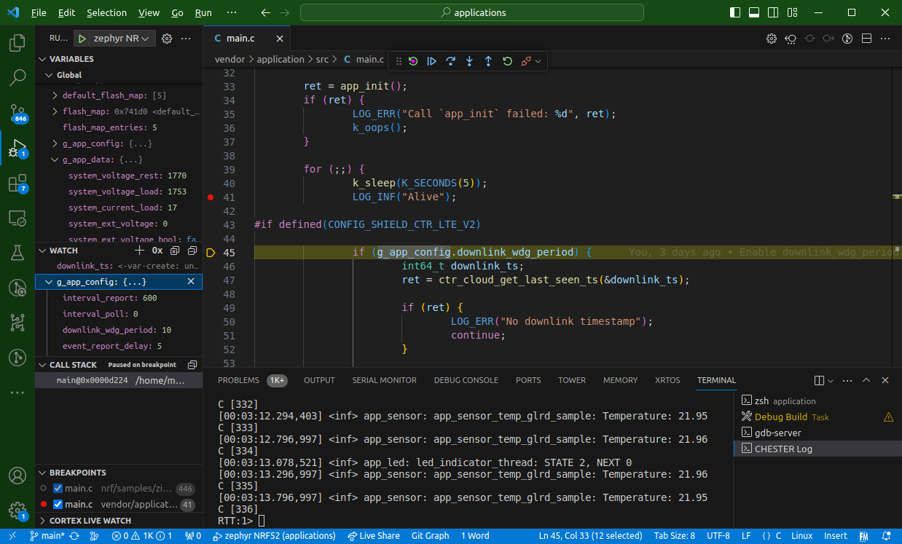

# VSCode Zephyr debug tasks and settings

Use this script to debug HARDWARIO CHESTER projects with `cortex-debug` and J-Link debugger.

## Instructions

1. Install `cortex-debug` in VSCode
   (Ctrl+P, paste `ext install marus25.cortex-debug`)
2. Copy or merge `.vscode` to your project root directory
3. Copy `debug.conf` to your project directory (next to your `prj.conf`). This will disable some optimization when you run `Debug Build` later.
4. In `settings.json` set the path to Zephyr SDK and the project path (location, where you run `west build`)
5. Debugging with J-Link needs `CONFIG_CTR_BLE=n` to disable MCUBoot, there is some issue that cortex-debug doesn't jump correctly to the ELF entry point.
6. Press `F1`, search for `Tasks: Run Task` and select `Debug Build`.
7. Press `F5` to start a debugger.
8. RTT CHESTER Log is opened in Terminal (cortex-debug doesn't allow second port to show Shell on port 0 at the same time, you have to edit `launch.json`)

Scripts are tested on Ubuntu. On Windows, you probably have to change every `/` to `\\`.

## TODO

- Add SVD files
- Fix the Mcuboot/BLE build not working with the debugger
- Use both RTT ports for shell and logs

## Sources

- https://blog.golioth.io/how-to-configure-vs-code-for-zephyr-development/
- https://medium.com/home-wireless/vscode-and-the-lora-e5-part-3-eb5238a40a72